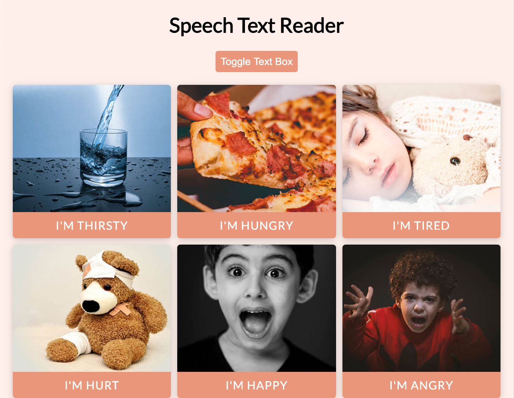
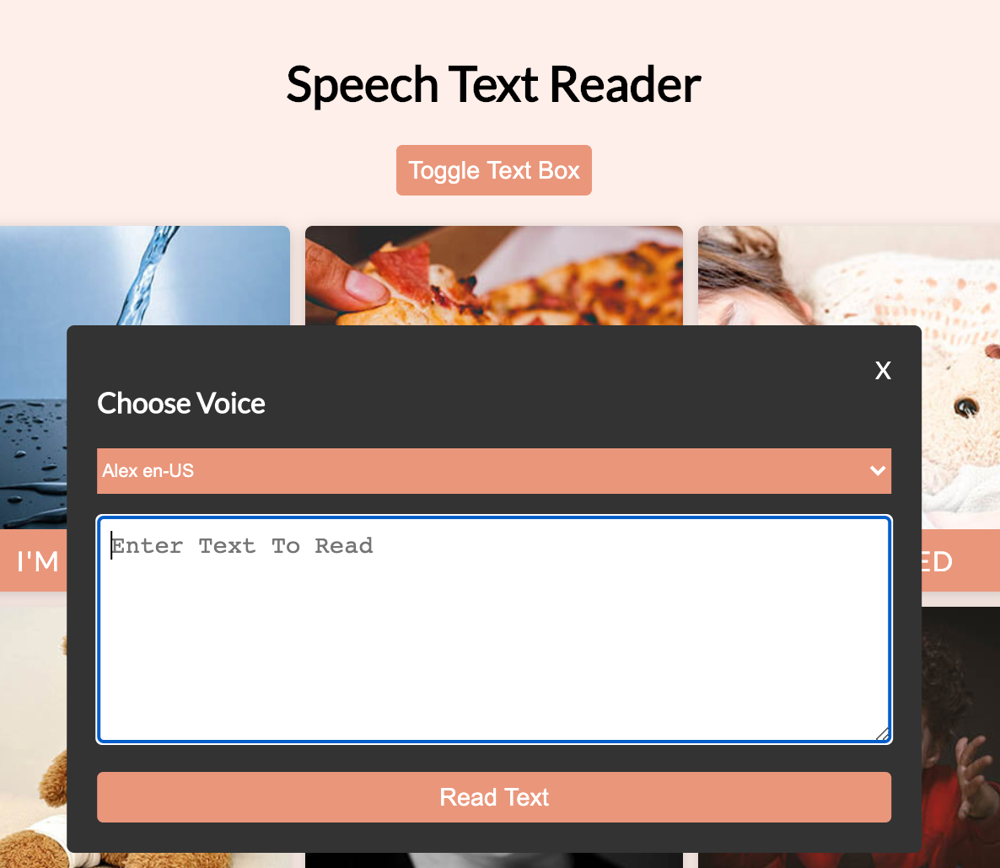
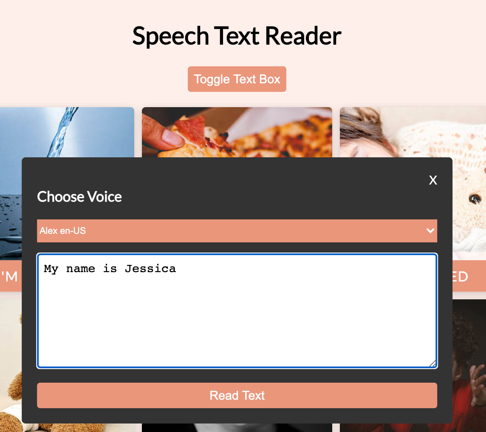

# Speech Text Reader

This project follows along with the [20 Web Projects With Vanilla JavaScript](https://www.udemy.com/course/web-projects-with-vanilla-javascript/) tutorials by Brad Traversy.

This project creates an application that allows the user to utilize a speech text reader functionality. The user has two main methods of functionality:

- click a preset button that has an image as well as text that reflects the image,
- toggle to the Text Box where the user can type a message to be read.

The user also is able to change the audible voice via dropdown after selecting the "Toggle Text Box" button. Upon page refresh, the voice will reset to the preset voice.

JavaScript, CSS, and HTML are used.

